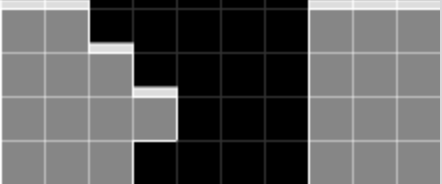

# hold-generalizer

Handle the creation of n-hold files from no hold

## Command Format

Windows `.\multihold.exe [options]`  
Mac/Linux `./multihold [options]`

Example:

```powershell
.\multihold.exe --sf path\to\sfinder.jar -c path --hold 2 -t "v115@9gB8EeF8DeG8CeF8DeC8JeAgH" -p "I,*p5" -a "-K kicks\jstris180.properties -d 180"
```

```bash
./multihold --sf path/to/sfinder.jar -c path --hold 2 -t 'v115@9gB8EeF8DeG8CeF8DeC8JeAgH' -p 'I,*p5' -a '-K kicks/jstris180.properties -d 180'
```

## Options

  `-h,--help` - Print this help message and exit  
  `--sf,--sfinder-file` REQUIRED  - File path to a sfinder.jar file  
  `-c,--command` REQUIRED  command to run sfinder with (path or cover)  
  `--hold` REQUIRED - number of hold  
  `--fp,--field-path` [input/field.txt] - file path to field file  
  `--pp,--patterns-path` [input/patterns.txt] - file path to patterns file  
  `--ppp,--patterms-permutated-path` [input/patternsPermutated.txt] - file path to patterns permutated file  
  `-t,--tetfu`              - fumen(s) for sfinder command  
  `-p,--patterns`           - pieces for sfinder command  
  `--mp,--manual-permutate`     - permutated patterns has been already created
  `--cycle`             - permutating by cycling the holds rather than allowing swapping with any held pieces
  `--of,--output-file`  [output/multihold_{command}.csv] - output filepath of command  
  `-a,--additional`         - other sfinder options to include in command  

## Additional Notes

The ability to hold allows for the usage of more pieces than the normal ability to use 11 pieces with hold 1.  
  
For example, PCO hold I setup usually would be ran with `I,*p4` with 1-hold. However, in 2-hold, it could be ran with `I,*p5` to maximize chances with looking at the 12th piece of 1st PC.  

Make sure to determine if adding pieces is reasonable when running the command, including considering if adding pieces would go beyond the numbers of pieces able to be seen.
